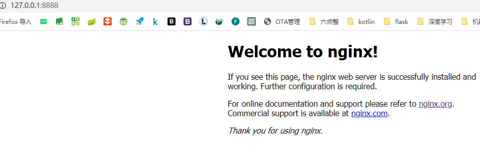

### 镜像操作：
1. 从仓库搜索镜像：`docker search image-name`  
	搜索结果过滤:
```
	* 是否是官方提供：  
		docker search --filter "is-official=true" image_name
	* 是否是自动化构建：  
		docker search --filter "is-automated=true" image_name
	* 大于多少个`star`  
		docker search --filter stars=3 image_name
```
	下载镜像：`docker pull image_name`  

2. 本地镜像的查看：`docker images`

3. 删除：`docker rmi image_name`
4. 修改镜像名字：`docker tag images_id 要推送的主机地址/镜像名：版本号`

### 容器基本操作：
1. 查看容器：`docker ps`
2. 创建容器: `docker run -itd --name=container_name images_name`
    * **-i**: 以交互模式运行容器;
    * **-d**: 后台运行;
    * **-t**: 为容器重新分配一个伪输入终端;
    * **--name**: 容器名字;
3. 查看所有容器: `docker ps -a`
4. 停止容器：`docker stop container_name`
5. 重启容器: `docker restart container_name`
6. 删除容器: `docker rm container_name` # 删除之前要先停止

### 容器修改与保存
1. 进入容器 `docker exec -it container_name /bin/bash`
2. 修改容器提交: `docker commit -a "author" -m "modify" container_name/container_id new_container_name:tag_name`

### 端口映射
1. `docker run -itd --name=container_name -p 8888:80 images_name`
	* **-p** 8888 指的是 宿主机端口->端口映射到容器80端口  访问：127.0.0.1:8888
	* **注意** 命令顺序不能反，`image_name`在最后  


