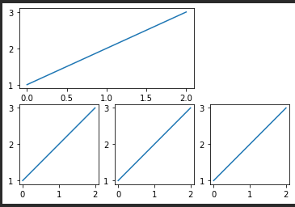
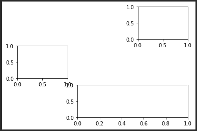
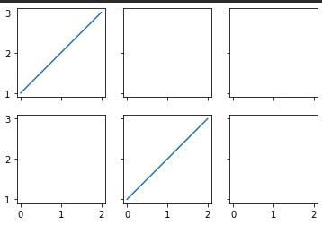

### 最简单方式创建子图
```python
import numpy as np
from matplotlib import pyplot as plt

np.random.seed(123456)
# 随机生成1-20的随机数
x = np.random.randint(1, 20, 20)

xmax = x.max()
xmin = x.min()
xmax, xmin
# 数据缩放到0-1的 区间
xx = (x - xmin) / (xmax - xmin)
# 2,1,1,  代表 画子图 2行1列第一 个位置
# 参数中间的逗号可以免掉不写，211
plt.subplot(211)
plt.plot(x)
plt.subplot(2,1,2)
plt.plot(y)

plt.show()
```


### 创建子图
```python
from matplotlib import pyplot as plt
# 第一个子图 将 整个图分成 2行1列，占据第1个位置
plt.subplot(211)
plt.plot([1,2],[3,4])
# 第二个子图 将整个图分成 2行3列 放在第4个位置，也就是2行第1位
plt.subplot(234)
plt.plot([1,2],[3,4])

plt.subplot(235)
plt.plot([1,2],[3,4])

plt.subplot(236)
plt.plot([1,2],[3,4])

plt.show()
```


### 在网格图中指定位置创建子图
```python
from matplotlib import pyplot as plt
# 背景颜色 白色
plt.figure(facecolor='white')
# shape: 网格形状 2行3列 一共6个单元的网格
# loc: 子图要方的位置，[0,0] 表示第一个格子
sub = plt.subplot2grid(shape=[2,3],loc=[0,0],colspan=2)
sub.plot([1,2,3])
sub1 = plt.subplot2grid([2,3],[1,0])
sub1.plot([1,2,3])
sub2 = plt.subplot2grid([2,3],[1,1])
sub2.plot([1,2,3])
sub3 = plt.subplot2grid([2,3],[1,2])
sub3.plot([1,2,3])

plt.show()

```


### 切片创建子图
```python
from matplotlib import pyplot as plt
from matplotlib import gridspec as gs
plt.figure(facecolor='white')
gs = gs.GridSpec(3,3)
plt.subplot(gs[0,2])
plt.subplot(gs[1,0])
plt.subplot(gs[2,1:])
plt.show()
```


### subplots 创建子图，共享x,y
```python
from matplotlib import pyplot as plt
# 创建子图 2行3列，共享x ,y 轴坐标
figure,subs = plt.subplots(nrows=2,ncols=3,sharex=True,sharey=True)
figure.set_facecolor('white')
subs[0,0].plot([1,2,3])
subs[1,1].plot([1,2,3])
plt.show()
```

