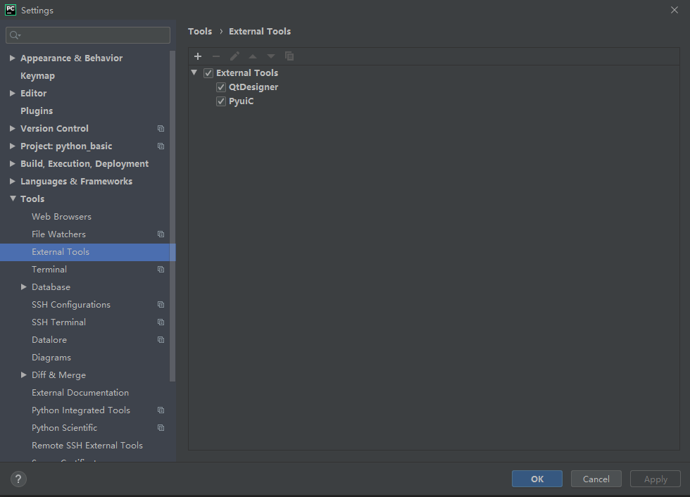
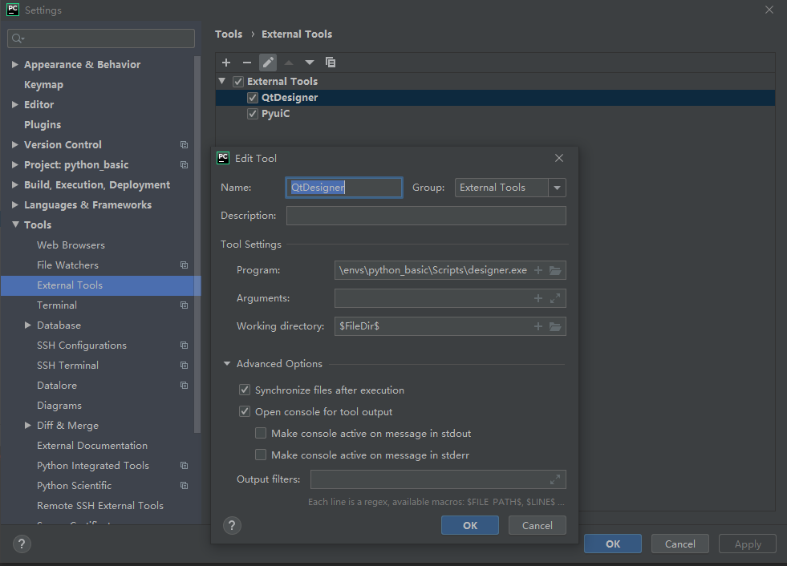
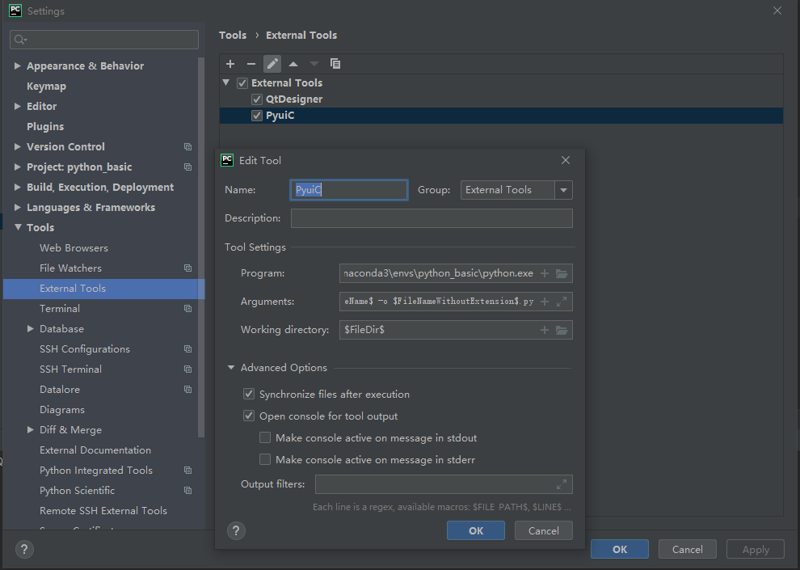
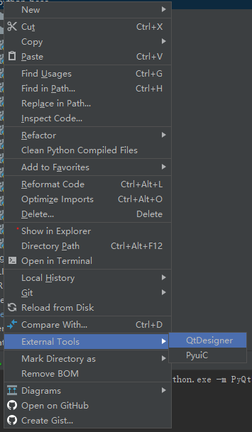
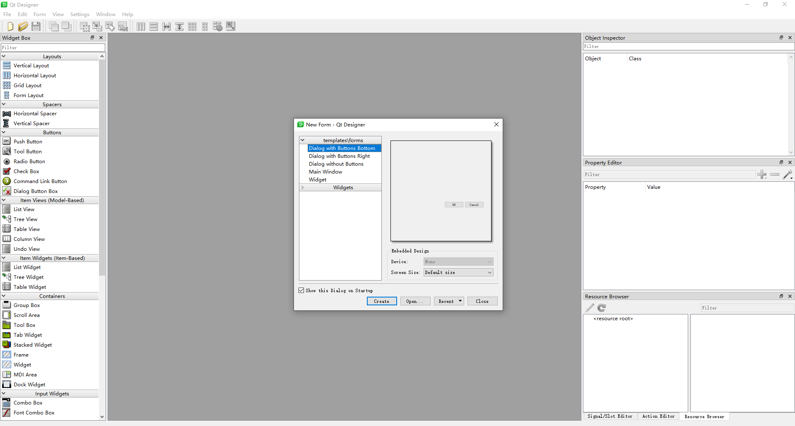
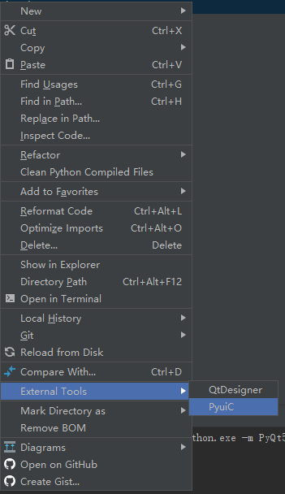

### windows 平台 环境配置
1. 首先安装pyqt5
```
pip install sip    //这个是pyqt开发商提供的支持包
pip install pyqt5
pip install pyqt5-tools
```


### pycharm 配置pyqt 可拖拽控件工具

1. 打开`pycharm` 找到`Tools/External_Tools` 新增一个

2. 找到`desiginer.exe`位置,我的是在anaconda3安装的，就在我的虚拟环境目录下面找到：

    D:\Anaconda3\envs\python_basic\Scripts\designer.exe

`Working directory` 这个路径是工作路径，所以一般就填入`$FileDir$`



3. 编辑完UI后，还需要转换成`py`文件才行，所以需要配置pyui转换

需要配置下参数：
```
Program: python.exe 路径
Arguments: -m PyQt5.uic.pyuic $FileName$ -o $FileNameWithoutExtension$.py
Working directory: $FileDir$
```




4. 第一次使用,先新建一个ui文件先

  

  
  妥妥拽拽一些控件华丽界面就完成了

5.  最后一步，转换成`py`文件
  

6. end
